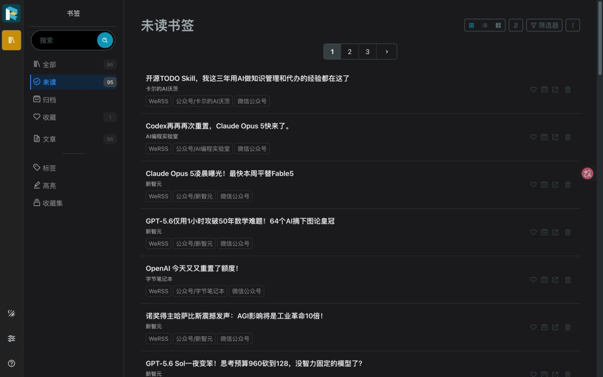

# WeRSS + Readeck + Obsidian 公众号阅读系统

这是一套免费、开源、可自托管的公众号阅读链路。Folo 不再是必需组件。

```text
微信公众号运营授权
  -> WeRSS 每小时抓取新文章与正文
  -> Readeck 全文阅读、收藏、划线、批注
  -> 本机同步器每 5 分钟检查
  -> 精选文章进入 SummerOS Archive
  -> Obsidian 保留原文、高亮、批注、我的笔记和双链
```

当前实测状态：12 个公众号、105 篇文章；101 篇达到正文门槛的文章已经全部且唯一进入 Readeck。已经用真实文章验证收藏、选中文字后下划线高亮、批注、Obsidian 入库和人工笔记不覆盖。

## 你最终怎么用

1. 平时打开 Readeck 浏览公众号文章。
2. 值得保留的文章点“收藏”；阅读时选中文字创建高亮，可同时写批注。
3. 后台同步器每 5 分钟运行一次。
4. 只要文章被收藏，或存在高亮/批注，就会自动进入 Obsidian：

```text
/Users/summer/Obsidian/SummerOS/
02_Archive/02_DailyProcessed/reading/readeck_inbox
```

5. Readeck 高亮会变成 Obsidian 的 `==高亮==`，批注会出现在摘录区和原文脚注中。
6. 你在顶部“我的笔记”里写的内容，以及 `rating`、`topics` 等人工字段，后续同步永远不会覆盖。




完整阅读教程见 [Readeck 与 Obsidian 图文教程](docs/Readeck与Obsidian图文教程.md)。

## 服务地址和访问方式

| 服务 | 地址 | 用途 |
| --- | --- | --- |
| WeRSS | `http://127.0.0.1:8001` | 微信授权、公众号管理、抓取任务 |
| Readeck 管理入口 | `http://127.0.0.1:8002` | 本机维护和故障恢复 |
| 只读 RSS 代理 | `http://127.0.0.1:8080` | 兼容其他 RSS 阅读器，可选 |
| Readeck 专用反代 | `http://127.0.0.1:8082` | 只供 Cloudflare Tunnel 使用 |
| 公网阅读器 | `https://reader.sumerchaser.top/` | 日常桌面/手机阅读，Cloudflare Access 保护 |

日常阅读不使用 Readeck 用户名和密码。公网入口已经启用 Cloudflare Access：新设备首次输入允许邮箱收到的一次性验证码，之后一周内直接进入文章库，不再出现 Readeck 登录表单。当前已登录 Chrome 已实测直接打开 `https://reader.sumerchaser.top/`。

WeRSS 和 Readeck 的本机管理员账号只用于维护与恢复。密码只保存在本机 `.env`，不要截图或发送给别人：

```bash
awk -F= '$1 == "WERSS_BOOTSTRAP_PASSWORD" { print $2 }' .env
awk -F= '$1 == "READECK_ADMIN_PASSWORD" { print $2 }' .env
```

## 1. 资格和限制

- 必须能在微信扫码时选择自己管理的公众号或服务号；普通个人微信关注列表不能直接授权 WeRSS。
- 微信没有文章 webhook。本方案的“实时”是安全近实时：WeRSS 每小时第 17 分钟抓取，同步器每 5 分钟搬运。通常延迟为几分钟到一小时多，不能承诺秒级。
- 微信风控出现 `200013` 时应暂停搜索和添加，不要高频重试。
- Mac 睡眠或关机时不会抓取。若要求全天稳定，应把同一 Compose 与数据迁移到 NAS 或常开服务器。
- WeRSS 固定上游镜像虽然声明 ARM64，实际层仍是 AMD64，目前通过 Rosetta 运行；Readeck 是原生 `aarch64`。

## 2. 初始化和启动

首次部署：

```bash
cd /Users/summer/Documents/wechat-rss
./scripts/doctor.sh
./scripts/init-secrets.sh
docker compose pull
docker compose up -d
./scripts/init-readeck.sh
```

已有 `.env` 时不要再次运行 `init-secrets.sh`；脚本也会拒绝覆盖。

启动后检查：

```bash
docker compose ps
./scripts/verify.sh --local
```

本机验证会检查：

- WeRSS、Readeck 与两个 Caddy 入口都只绑定 `127.0.0.1`。
- WeRSS 管理端正常，随机 Feed 路径返回合法 Atom。
- Feed 代理的根路径、API、非 Atom、写方法和路径穿越均被拒绝。
- Readeck 未登录首页跳转到登录页，未登录 API 返回 `401`。
- Readeck 专用代理没有绕过登录边界。
- 自定义阅读主题使用 macOS 中文系统字体栈，桌面正文宽度 736 px、行高 1.8；390×844 移动视口无横向溢出。

由于 WeRSS 上游镜像问题，脚本最后仍会对非原生 ARM64 返回非零；前面的安全、Feed 与 Readeck 检查仍会完整执行。

## 3. 微信授权和公众号抓取

用 Chrome 打开 `http://127.0.0.1:8001`：

1. 登录 WeRSS。
2. 完成公众号运营者扫码授权。
3. 添加要看的公众号；搜索和添加之间间隔 30–60 秒。
4. 确认任务“公众号每小时自动更新”已启用，Cron 为：

```text
17 * * * *
```

5. 添加后可手工运行一次全部公众号更新。不要相信接口里偶发的“执行 0 个订阅号”文案，应以任务队列、文章数量和正文状态为准。

本机 Feed 仍可用于其他阅读器：

```text
http://127.0.0.1:8001/feed/all.atom
http://127.0.0.1:8001/feed/<公众号ID>.atom
```

## 4. Readeck 全量文章库

自动同步器做两层筛选：

- WeRSS → Readeck：所有已经抓到完整正文的文章都会进入 Readeck。
- Readeck → Obsidian：默认只导出“已收藏”或“含高亮/批注”的文章，避免 Obsidian 变成全文垃圾场。

同步器安装：

```bash
./scripts/install-reading-sync.sh
```

LaunchAgent 名称：

```text
com.summer.wechat-rss-reading-sync
```

查看最近结果：

```bash
tail -n 20 /tmp/wechat-rss-reading-sync.log
launchctl print gui/$UID/com.summer.wechat-rss-reading-sync
```

手工立即运行：

```bash
/usr/bin/python3 ~/.local/share/wechat-rss/reading-sync.py
```

日志示例中的正常幂等结果应为“新入 Readeck 0 篇、Obsidian 更新 0 篇”。

## 5. Obsidian 笔记结构

文件名固定为：

```text
发布日期-标题--Readeck短ID.md
```

因此同标题文章不会互相覆盖。每篇笔记包含：

```markdown
---
reading_status: 待读
rating:
topics: []
promote_to: 无
reviewed_at:
---

> [!note] 我的笔记
> - 为什么保存：
> - 核心判断：
> - 我是否同意：
> - 可执行动作：
> - 关联主题：

## 划线与批注

> ==从 Readeck 同步的高亮==
> 批注：从 Readeck 同步的批注

## 原文
```

“我的笔记”和人工 frontmatter 是人工区；“划线与批注”和“原文”是机器管理区。重复同步只刷新机器区。

真实样本连续运行同步两次后，文件 SHA-256 和 mtime 都保持不变；没有新增内容时不会重写笔记。


`公众号精选.base` 已在 Obsidian 1.12.7 实机验证；横向表格包含文章、公众号、作者、发布时间、收纳日期、阅读状态、评分、主题和提升去向。


原文始终留在 Archive。值得进入 `03_Knowledge` 或 `04_Output` 时，创建新的综合条目并引用原文，不移动或公开整篇公众号文章。

v1 不把全部图片复制进 Vault；Markdown 图片仍引用 Readeck 资源地址。Cloudflare 配好后跨设备可加载这些图片，但资源 URL 本身相当于不可猜测链接。只有评级 4–5 或准备输出的文章，再单独做附件本地化。

## 6. Cloudflare 外网阅读

Cloudflare Tunnel 与 Zero Trust Free 计划适合在手机或外网打开 Readeck。目标地址为：

```text
https://reader.sumerchaser.top/
```

安全顺序固定为：先启用 Zero Trust、创建 Access 应用和允许策略，再创建 Tunnel/DNS，最后运行公网验收。不能先把裸 Readeck 发布到公网。

当前已经按该顺序启用 Zero Trust Free、精确邮箱 Access 策略、独立 Tunnel、DNS 和 LaunchAgent。需要重新生成本机 Tunnel 配置时运行：

```bash
./scripts/configure-cloudflare-tunnel.sh
```

脚本会：

1. 打开 Cloudflare 官方授权页。
2. 创建独立的 `wechat-rss` Tunnel，不复用其他项目 Tunnel。
3. 把 `reader.sumerchaser.top` 指向本机 `127.0.0.1:8082`。
4. 将作用域凭据保存到 `~/.cloudflared/`，权限设为 `600`。
5. 安装 macOS LaunchAgent，开机自动保持连接。
6. 把 Readeck 的公开基地址改为 HTTPS 域名。

公网验收：

```bash
./scripts/verify.sh --reader-public
```

当前实测访问契约是：已授权设备无需 Readeck 用户名和密码；无 Cookie 的请求不能读取文章；未授权 `/api/bookmarks` 返回 `401/403`，未授权 `/feed/all.atom` 被 Access 拦截；授权会话中的 `/feed/all.atom` 由 Readeck 返回 `404`。WeRSS 管理端不会通过这个 Tunnel 暴露。


停止本机 Tunnel，但不删除 Cloudflare 端对象：

```bash
./scripts/disable-cloudflare-tunnel.sh
```

## 7. 备份和恢复

每周和升级前运行：

```bash
./scripts/backup.sh
```

备份会短暂停止 WeRSS 与 Readeck，确保 SQLite/WAL 一致，并包含：

- WeRSS SQLite、授权文件、登录密钥和缓存数据。
- Readeck 用户、90+ 篇文章、收藏、高亮、批注和资源文件。
- `.env`、最小权限 Readeck API Token、同步映射数据库。
- Compose、两个 Caddy 配置和操作说明。
- 若 Cloudflare 已启用，则包含该 Tunnel 的本机配置和作用域凭据；不包含高权限账户 `cert.pem`。

归档权限为 `600`。独立恢复演练：

```bash
./scripts/restore-test.sh
```

恢复脚本使用独立目录、不同 Compose project 和随机端口，不覆盖线上数据；会检查三个 SQLite 数据库、WeRSS Feed、Readeck 登录、用户、文章、收藏和批注数量。

## 8. 安全边界

- 不提交或分享 `.env`、`data/`、`readeck-data/`、`backups/`、API Token、Cloudflare 凭据和随机 Feed 前缀。
- WeRSS 会把环境变量写入容器日志，不要公开 `docker compose logs we-mp-rss`。
- Readeck API Token 只授予书签读写权限，不授予用户、系统或管理权限。
- Readeck 与 WeRSS 均只监听本机回环地址。
- 不安装 Watchtower，不跟随 `latest`；镜像使用固定摘要。
- Cloudflare 只暴露 Readeck 专用代理，不暴露 WeRSS、Docker 或本机其他端口。

## 9. 常见问题

系统还安装了一个为期 8 天的 Codex 只读巡检 `wechat-rss-stability-watch`，每天记录容器、文章计数、最新发布时间和同步状态到被 Git 忽略的 `observations/readeck-stability.tsv`。它不会读取或输出密钥，也不会自行修改 Cloudflare、DNS 或账号权限。

### 为什么新公众号文章不全？

WeRSS 首次只抓有限历史页，并受公众号授权范围、微信风控和正文抓取成功率影响。先检查：

1. 公众号是否已加入 WeRSS。
2. 全部公众号更新任务是否执行完成。
3. 文章是否已经 `has_content=1`；正文未就绪的文章不会进入 Readeck。
4. Mac 在计划执行时间是否处于唤醒状态。

### 为什么 Readeck 有文章，Obsidian 没有？

这是默认设计。只有点收藏，或创建至少一条高亮/批注，文章才进入 Obsidian。

### 可以把全部文章都导入 Obsidian 吗？

可以手工运行：

```bash
/usr/bin/python3 ~/.local/share/wechat-rss/reading-sync.py --sync-all
```

不建议长期这样做；Readeck 更适合放完整阅读库，Obsidian 更适合放人工筛选后的知识材料。

### Folo 还需要吗？

不需要。Folo 可作为可选 RSS 客户端，但本项目主链路不依赖其付费订阅、私密 Feed 或 Obsidian 集成。

完整验收矩阵见 [docs/验收清单.md](docs/验收清单.md)。
