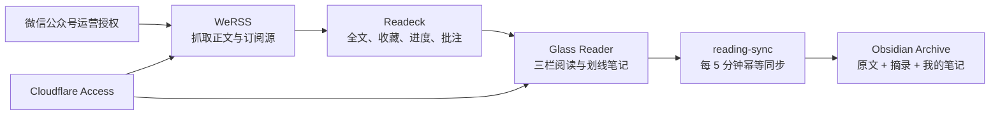
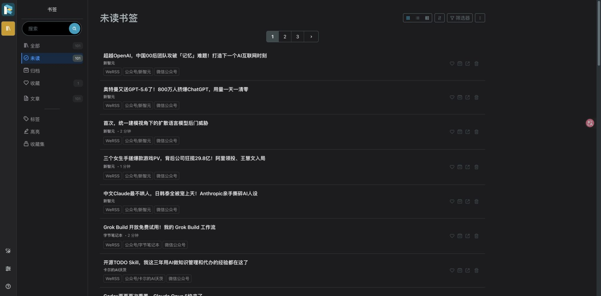

<div align="center">

# WeChat RSS Reader

### 把微信公众号变成一个真正属于你的阅读与知识系统

**WeRSS 抓取 · Readeck 持久化 · Apple 磨砂 Reader · Obsidian 沉淀 · Cloudflare 私有访问**

[](https://github.com/summerchaserwwz/wechat-rss-reader)
[](compose.yaml)
[](.github/workflows/ci.yml)
[](SECURITY.md)
[](LICENSE)


</div>

> 这是 WeRSS、Readeck 与 Obsidian 的集成部署层，不是三个上游项目的 Fork。仓库提供固定镜像、Reader UI、同步器、安全反代、Cloudflare Tunnel、备份恢复和可执行文档；真实文章、微信授权与密钥永远留在你的机器上。

## 为什么是这套组合

| 你要的能力 | 由谁负责 | 结果 |
| --- | --- | --- |
| 公众号持续更新与全文抓取 | WeRSS | 每小时自动检查，也可在 Reader 主动刷新 |
| 干净的三栏阅读体验 | 自定义 Reader + Readeck | 未读、收藏、价值、标签、字号、移动端 |
| 划线、摘录与批注 | Readeck + Reader | 淡绿虚线不遮字，保存后原位显示笔记 |
| Markdown 与知识沉淀 | reading-sync + Obsidian | 精选原文、摘录、批注和人工笔记安全共存 |
| 手机/外网私有访问 | Cloudflare Access + Tunnel | 不开放源端口，Reader 与管理端独立授权 |
| 可恢复、可升级 | 备份/恢复脚本 + 固定镜像摘要 | SQLite、Token、授权和主题一起恢复 |

## 系统怎么联动



核心规则很简单：**完整正文全部进 Reader；只有收藏或含划线/批注的文章默认进 Obsidian。** 因此阅读库可以很大，知识库仍保持干净。

## 5 分钟本机启动

要求：Apple Silicon macOS、Docker Desktop、Chrome；要抓公众号还需要公众号/服务号运营权限。

```bash
git clone https://github.com/summerchaserwwz/wechat-rss-reader.git
cd wechat-rss-reader

./scripts/doctor.sh
./scripts/init-secrets.sh
docker compose pull
docker compose up -d
./scripts/init-readeck.sh
```

然后打开：

- WeRSS 管理：`http://127.0.0.1:8001`
- Reader/Readeck：`http://127.0.0.1:8002`
- 自定义 Reader 反代：`http://127.0.0.1:8082`

首次生成的 WeRSS 用户名和随机密码保存在本机 `.env`：

```bash
awk -F= '$1 == "WERSS_ADMIN_USERNAME" || $1 == "WERSS_BOOTSTRAP_PASSWORD" { print }' .env
```

不要把 `.env` 提交到 Git。首次启动前可修改 `WERSS_ADMIN_USERNAME`；系统已经初始化后请运行 `./scripts/change-werss-admin.sh <新用户名>`。密码建议至少 24 位随机字符。

## 你最终怎么用

1. 在 WeRSS 完成运营者扫码，添加公众号，并启用每小时任务。
2. 在 Reader 浏览所有完整文章；打开后自动记录阅读进度，滚动到 80% 自动已读。
3. 值得保留的文章点收藏；拖选文字即可高亮和批注，弹层会自动避开选区。
4. 顶部“划线笔记”集中显示摘录、笔记、文章与来源；可下载 Markdown 或直接选择 Obsidian 目录。
5. 后台同步器每 5 分钟把收藏或含划线的文章写入 `OBSIDIAN_INBOX_DIR`。
6. Obsidian 中人工 frontmatter 和“我的笔记”永不被后续同步覆盖。

<table>
  <tr>
    <td width="50%"></td>
    <td width="50%"></td>
  </tr>
  <tr>
    <td align="center">批注弹层避让选区</td>
    <td align="center">摘录集中管理与字号控制</td>
  </tr>
</table>

<table>
  <tr>
    <td width="50%"></td>
    <td width="50%"></td>
  </tr>
  <tr>
    <td align="center">原文、高亮、批注与我的笔记</td>
    <td align="center">390 px 移动端阅读</td>
  </tr>
</table>

当前维护者部署已用 12 个公众号和 100+ 篇真实文章验证全量同步、收藏、自动已读、划线批注、Markdown/Obsidian 入库和重复同步不覆盖。完整操作见 [图文教程](docs/Readeck与Obsidian图文教程.md)，部署细节见 [部署指南](docs/DEPLOYMENT.md)。

## 服务地址和访问方式

| 服务 | 地址 | 用途 |
| --- | --- | --- |
| WeRSS 本机入口 | `http://127.0.0.1:8001` | 部署 Mac 上的微信授权、公众号管理、抓取任务 |
| Readeck 管理入口 | `http://127.0.0.1:8002` | 本机维护和故障恢复 |
| 只读 RSS 代理 | `http://127.0.0.1:8080` | 兼容其他 RSS 阅读器，可选 |
| Readeck 专用反代 | `http://127.0.0.1:8082` | 只供 Cloudflare Tunnel 使用 |
| WeRSS 专用反代 | `http://127.0.0.1:8083` | 只供 Cloudflare Tunnel 使用 |
| 公网阅读器 | `https://reader.example.com/` | 替换成你的域名，Cloudflare Access 保护 |
| 公网 WeRSS 管理 | `https://werss.example.com/` | 替换成你的域名，使用独立 Access 应用 |

日常阅读不使用 Readeck 用户名和密码。配置 Cloudflare Access 后，新设备首次输入允许邮箱收到的一次性验证码，之后在会话有效期内直接进入文章库，不再出现 Readeck 登录表单。

WeRSS 公网入口使用另一个 Access 应用和独立 AUD。通过 Access 后仍保留 WeRSS 自己的管理登录，这是对公众号授权和抓取配置的第二层保护。

WeRSS 和 Readeck 的本机管理员账号只用于维护与恢复。密码只保存在本机 `.env`，不要截图或发送给别人：

```bash
awk -F= '$1 == "WERSS_BOOTSTRAP_PASSWORD" { print $2 }' .env
awk -F= '$1 == "READECK_ADMIN_PASSWORD" { print $2 }' .env
```

## 1. 资格和限制

- 必须能在微信扫码时选择自己管理的公众号或服务号；普通个人微信关注列表不能直接授权 WeRSS。
- 微信没有文章 webhook。本方案的“实时”是安全近实时：WeRSS 每小时第 17 分钟抓取，同步器每 5 分钟搬运。通常延迟为几分钟到一小时多，不能承诺秒级。
- 微信风控出现 `200013` 时应暂停搜索和添加，不要高频重试。
- Mac 睡眠或关机时不会抓取。若要求全天稳定，应把同一 Compose 与数据迁移到 NAS 或常开服务器。
- WeRSS 固定上游镜像虽然声明 ARM64，实际层仍是 AMD64，目前通过 Rosetta 运行；Readeck 是原生 `aarch64`。

## 2. 初始化和启动

首次部署：

```bash
cd wechat-rss-reader
./scripts/doctor.sh
./scripts/init-secrets.sh
docker compose pull
docker compose up -d
./scripts/init-readeck.sh
```

已有 `.env` 时不要再次运行 `init-secrets.sh`；脚本也会拒绝覆盖。

启动后检查：

```bash
docker compose ps
./scripts/verify.sh --local
```

本机验证会检查：

- WeRSS、Readeck 与三个 Caddy 入口都只绑定 `127.0.0.1`。
- WeRSS 管理端正常，随机 Feed 路径返回合法 Atom。
- Feed 代理的根路径、API、非 Atom、写方法和路径穿越均被拒绝。
- Readeck 未登录首页跳转到登录页，未登录 API 返回 `401`。
- Readeck 专用代理没有绕过登录边界。
- 自定义阅读主题使用 macOS 中文系统字体栈，桌面正文宽度 736 px、行高 1.8；390×844 移动视口无横向溢出。

由于 WeRSS 上游镜像问题，脚本最后仍会对非原生 ARM64 返回非零；前面的安全、Feed 与 Readeck 检查仍会完整执行。

## 3. 微信授权和公众号抓取

在阅读器左侧公众号区域点 `+`，或直接打开你配置的 `https://werss.example.com/`。部署 Mac 也可使用 `http://127.0.0.1:8001`：

1. 登录 WeRSS。
2. 完成公众号运营者扫码授权。
3. 添加要看的公众号；搜索和添加之间间隔 30–60 秒。
4. 确认任务“公众号每小时自动更新”已启用，Cron 为：

```text
17 * * * *
```

5. 添加后回到阅读器点“检查新文章”。不要相信 WeRSS 接口里偶发的“执行 0 个订阅号”文案，应以任务队列、文章数量和正文状态为准。

本机 Feed 仍可用于其他阅读器：

```text
http://127.0.0.1:8001/feed/all.atom
http://127.0.0.1:8001/feed/<公众号ID>.atom
```

## 4. Readeck 全量文章库

自动同步器做两层筛选：

- WeRSS → Readeck：所有已经抓到完整正文的文章都会进入 Readeck。
- Readeck → Obsidian：默认只导出“已收藏”或“含高亮/批注”的文章，避免 Obsidian 变成全文垃圾场。

同步器安装：

```bash
./scripts/install-reading-sync.sh
```

LaunchAgent 名称：

```text
com.summer.wechat-rss-reading-sync
```

查看最近结果：

```bash
tail -n 20 /tmp/wechat-rss-reading-sync.log
launchctl print gui/$UID/com.summer.wechat-rss-reading-sync
```

手工立即运行：

```bash
/usr/bin/python3 ~/.local/share/wechat-rss/reading-sync.py
```

日志示例中的正常幂等结果应为“新入 Readeck 0 篇、Obsidian 更新 0 篇”。

## 5. Obsidian 笔记结构

文件名固定为：

```text
发布日期-标题--Readeck短ID.md
```

因此同标题文章不会互相覆盖。每篇笔记包含：

```markdown
---
reading_status: 待读
rating:
topics: []
promote_to: 无
reviewed_at:
---

> [!note] 我的笔记
> - 为什么保存：
> - 核心判断：
> - 我是否同意：
> - 可执行动作：
> - 关联主题：

## 划线与批注

> ==从 Readeck 同步的高亮==
> 批注：从 Readeck 同步的批注

## 原文
```

“我的笔记”和人工 frontmatter 是人工区；“划线与批注”和“原文”是机器管理区。重复同步只刷新机器区。

真实样本连续运行同步两次后，文件 SHA-256 和 mtime 都保持不变；没有新增内容时不会重写笔记。


`公众号精选.base` 已在 Obsidian 1.12.7 实机验证；横向表格包含文章、公众号、作者、发布时间、收纳日期、阅读状态、评分、主题和提升去向。


原文始终留在 Archive。值得进入 `03_Knowledge` 或 `04_Output` 时，创建新的综合条目并引用原文，不移动或公开整篇公众号文章。

v1 不把全部图片复制进 Vault；Markdown 图片仍引用 Readeck 资源地址。Cloudflare 配好后跨设备可加载这些图片，但资源 URL 本身相当于不可猜测链接。只有评级 4–5 或准备输出的文章，再单独做附件本地化。

## 6. Cloudflare 外网阅读

Cloudflare Tunnel 与 Zero Trust Free 计划同时保护日常阅读和 WeRSS 管理。两个目标地址为：

```text
https://reader.example.com/
https://werss.example.com/
```

安全顺序固定为：先启用 Zero Trust、创建 Access 应用和允许策略，再创建 Tunnel/DNS，最后运行公网验收。不能先把裸 Readeck 发布到公网。

完成 Zero Trust Free、精确邮箱 Access 策略、独立 Tunnel 和 DNS 后，运行以下命令生成本机 Tunnel 配置：

```bash
./scripts/configure-cloudflare-tunnel.sh
```

脚本会：

1. 打开 Cloudflare 官方授权页。
2. 创建独立的 `wechat-rss` Tunnel，不复用其他项目 Tunnel。
3. 把 `reader.example.com` 指向本机 `127.0.0.1:8082`，把 `werss.example.com` 指向本机 `127.0.0.1:8083`。
4. 将作用域凭据保存到 `~/.cloudflared/`，权限设为 `600`。
5. 安装 macOS LaunchAgent，开机自动保持连接。
6. 为 Reader 与 WeRSS ingress 分别写入各自 Access AUD，并把 Readeck 的公开基地址改为 HTTPS 域名。

公网验收：

```bash
./scripts/verify.sh --reader-public
./scripts/verify-werss-public.sh
```

验收契约是：已授权设备无需 Readeck 用户名和密码；无 Cookie 的请求不能读取文章；未授权 Reader、API 和 Feed 都被 Access 拦截。WeRSS 管理端只通过独立 Access 应用进入，匿名根路径和 API 均被边缘拦截，源站仍只监听回环地址。



停止本机 Tunnel，但不删除 Cloudflare 端对象：

```bash
./scripts/disable-cloudflare-tunnel.sh
```

## 7. 备份和恢复

每周和升级前运行：

```bash
./scripts/backup.sh
```

备份会短暂停止 WeRSS 与 Readeck，确保 SQLite/WAL 一致，并包含：

- WeRSS SQLite、授权文件、登录密钥和缓存数据。
- Readeck 用户、全部文章、收藏、高亮、批注和资源文件。
- `.env`、最小权限 Readeck API Token、同步映射数据库。
- Compose、三个 Caddy 配置、主动刷新控制端和操作说明。
- 若 Cloudflare 已启用，则包含该 Tunnel 的本机配置和作用域凭据；不包含高权限账户 `cert.pem`。

归档权限为 `600`。独立恢复演练：

```bash
./scripts/restore-test.sh
```

恢复脚本使用独立目录、不同 Compose project 和随机端口，不覆盖线上数据；会检查三个 SQLite 数据库、WeRSS Feed、Readeck 登录、用户、文章、收藏和批注数量。

## 8. 安全边界

- 不提交或分享 `.env`、`data/`、`readeck-data/`、`backups/`、API Token、Cloudflare 凭据和随机 Feed 前缀。
- WeRSS 会把环境变量写入容器日志，不要公开 `docker compose logs we-mp-rss`。
- Readeck API Token 只授予书签读写权限，不授予用户、系统或管理权限。
- Readeck 与 WeRSS 均只监听本机回环地址。
- 不安装 Watchtower，不跟随 `latest`；镜像使用固定摘要。
- Cloudflare 只暴露 Reader 与 WeRSS 两个专用 Caddy；两者使用独立 Access 应用和 AUD。Docker、WeRSS 原始端口及本机其他端口均不公开。

## 9. 常见问题

系统还安装了一个为期 8 天的 Codex 只读巡检 `wechat-rss-stability-watch`，每天记录容器、文章计数、最新发布时间和同步状态到被 Git 忽略的 `observations/readeck-stability.tsv`。它不会读取或输出密钥，也不会自行修改 Cloudflare、DNS 或账号权限。

### 为什么新公众号文章不全？

WeRSS 首次只抓有限历史页，并受公众号授权范围、微信风控和正文抓取成功率影响。先检查：

1. 公众号是否已加入 WeRSS。
2. 全部公众号更新任务是否执行完成。
3. 文章是否已经 `has_content=1`；正文未就绪的文章不会进入 Readeck。
4. Mac 在计划执行时间是否处于唤醒状态。

### 怎么追加新的公众号？

在阅读器左侧公众号标题旁点 `+`，打开 Access 保护的 WeRSS 管理后台，搜索并添加公众号，再回到阅读器点“检查新文章”。手机和外网设备也可以完成，不再要求回到部署 Mac。

### 为什么 Readeck 有文章，Obsidian 没有？

这是默认设计。只有点收藏，或创建至少一条高亮/批注，文章才进入 Obsidian。

### 划线笔记怎么导出，Obsidian 路径怎么改？

打开顶部“划线笔记”：

1. 点下载按钮，会生成带日期、摘录、笔记、公众号、文章标题和原文链接的 Markdown 文件。
2. 点文件夹按钮，选择任意本机 Obsidian 目录；以后“导出全部划线笔记”会直接覆盖该目录中的汇总 Markdown。
3. 需要换位置时再次点文件夹按钮；不支持目录授权的浏览器仍可使用 Markdown 下载。

这个浏览器目录只影响手工汇总导出。后台每 5 分钟的逐篇自动同步目录仍是 `02_Archive/02_DailyProcessed/reading/readeck_inbox`，两条路径互不冲突。

### 可以把全部文章都导入 Obsidian 吗？

可以手工运行：

```bash
/usr/bin/python3 ~/.local/share/wechat-rss/reading-sync.py --sync-all
```

不建议长期这样做；Readeck 更适合放完整阅读库，Obsidian 更适合放人工筛选后的知识材料。

### Folo 还需要吗？

不需要。Folo 可作为可选 RSS 客户端，但本项目主链路不依赖其付费订阅、私密 Feed 或 Obsidian 集成。

完整验收矩阵见 [docs/验收清单.md](docs/验收清单.md)。

## 项目结构

```text
reader-ui/          Apple 磨砂三栏 Reader
reader-theme/       注入 Readeck 正文的阅读主题
scripts/            初始化、同步、主动刷新、Cloudflare、备份恢复
config/             LaunchAgent 与 Tunnel 示例
docs/               部署、使用、架构、截图与验收证据
compose.yaml        WeRSS + Readeck + 三个 Caddy
```

## 上游与许可证

本仓库只维护集成代码和部署配置。WeRSS、Readeck、Caddy 与 Cloudflare Tunnel 仍是各自独立项目，使用时请同时遵守各上游许可证与服务条款。本仓库自有部分使用 [MIT License](LICENSE)。
