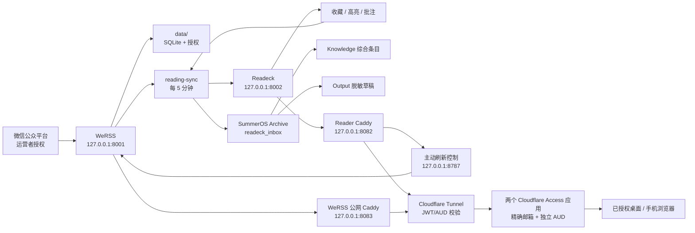

# 系统图谱

Context Doc Type: system-map
Owner: coordinator
Source Evidence: `compose.yaml`; `Caddyfile.reader`; `Caddyfile.werss-public`; `scripts/reading-sync.py`; `scripts/reader-refresh-control.py`; SummerOS reading files
Last Verified: 2026-07-15
Confidence: high

## Scope

## Trust Boundaries

- `.env`、`data/`、`readeck-data/`、API Token、备份：本机 secret-bearing。
- `127.0.0.1:8001`：WeRSS 原始管理端，仅本机回环；公网只能经 `8083` 专用 Caddy 和 Access 进入。
- `127.0.0.1:8002`：Readeck 直连，仅本机。
- `127.0.0.1:8082`：Reader Tunnel origin，只到 Readeck；公网 Host 无 Access 身份时本机即 403。
- `127.0.0.1:8083`：WeRSS Tunnel origin；缺 Access JWT/精确邮箱时 403，非目标 Host 404。
- `127.0.0.1:8787`：主动刷新控制端，只接受 Reader Caddy 注入内部密钥后的回环 POST。
- `reader.sumerchaser.top`：Access 保护的私有入口；`cloudflared` 必须按 team/AUD 验证 JWT，Caddy 再校验精确邮箱并映射固定 Readeck 用户。
- `werss.sumerchaser.top`：独立 Access 应用/AUD 保护的 WeRSS 管理入口；通过 Access 后仍保留 WeRSS 原生管理登录。
- Obsidian 原文：私有 Archive；公开只使用衍生、脱敏内容。
- Folo/Tailscale：保留为可选历史组件，不属于主链路或完成门禁。
