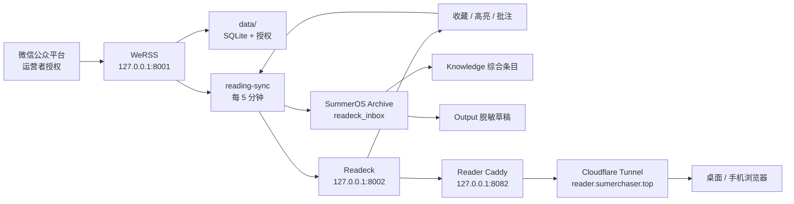

# 系统图谱

Context Doc Type: system-map
Owner: coordinator
Source Evidence: `compose.yaml`; `Caddyfile.reader`; `scripts/reading-sync.py`; SummerOS reading files
Last Verified: 2026-07-15
Confidence: high

## Scope

## Trust Boundaries

- `.env`、`data/`、`readeck-data/`、API Token、备份：本机 secret-bearing。
- `127.0.0.1:8001`：WeRSS 管理端，永不公开。
- `127.0.0.1:8002`：Readeck 直连，仅本机。
- `127.0.0.1:8082`：Cloudflare 唯一 origin，只到 Readeck。
- `reader.sumerchaser.top`：公网登录面；匿名 API 必须为 `401`。
- Obsidian 原文：私有 Archive；公开只使用衍生、脱敏内容。
- Folo/Tailscale：保留为可选历史组件，不属于主链路或完成门禁。
