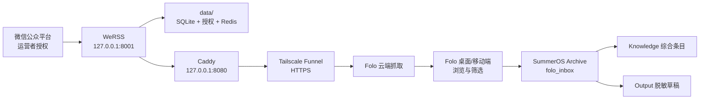

# 系统图谱

Context Doc Type: system-map
Owner: coordinator
Source Evidence: `compose.yaml`; `Caddyfile`; `README.md`; SummerOS reading files
Last Verified: 2026-07-14
Confidence: high

## Scope

图谱覆盖从公众号运营者授权到 SummerOS 知识提升的完整边界；Folo 与 Tailscale 是外部服务，Obsidian Vault 是独立 dirty 仓库。

## Trust Boundaries

- `.env`、`data/`、备份：本机 secret-bearing。
- 随机 Feed URL：可公网读取的 bearer-secret URL。
- Folo：外部云服务，会持有 Feed URL。
- Obsidian 原文：私有 Archive；公开前删除 `feedUrl` 并遵守版权边界。
