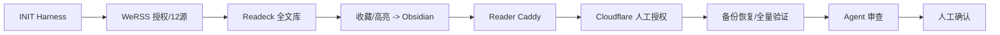
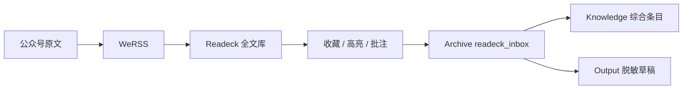

# Visual Map / 可视化图谱

Visual Map Contract: v1.0

## 阶段关系图

## 阶段表

| Phase ID | Kind | Depends On | State | Completion | Output | Required Evidence | Exit Command | Actor | Evidence Status | Blocking Risk | Owner / Handoff |
| --- | --- | --- | --- | ---: | --- | --- | --- | --- | --- | --- | --- |
| INIT-01 | init | none | done | 100 | Harness task files | status/check | n/a | agent | present | none | coordinator |
| WERSS-01 | execution | INIT-01 | in_progress | 85 | 12 源、94 篇、每小时 Cron | SQLite、任务队列、72h/7d | n/a | coordinator | partial | 时间证据 | user + coordinator |
| READECK-01 | execution | WERSS-01 | done | 100 | 90 loaded、aarch64、中文 UI | API/SQLite/UI | n/a | agent | present | 4 篇正文未就绪 | coordinator |
| OBSIDIAN-01 | execution | READECK-01 | in_progress | 90 | 收藏/高亮/批注/不覆盖 | 真实笔记、hash、UI screenshot | n/a | agent | partial | Mac 锁屏 | user + coordinator |
| CLOUDFLARE-01 | gate | OBSIDIAN-01 | in_progress | 40 | Reader Caddy 与 Tunnel 脚本 | 303/401、Tunnel/DNS、公网 smoke | n/a | coordinator | partial | 持久账号授权 | user + coordinator |
| RECOVERY-01 | execution | READECK-01 | done | 100 | 扩展备份恢复 | 三 SQLite、用户/文章/收藏/批注 | n/a | agent | present | none | coordinator |
| REVIEW-01 | gate | CLOUDFLARE-01,RECOVERY-01 | planned | 0 | Agent Review Submission | tests、diff、live evidence、review.md | harness task-review | agent | partial | live gate | coordinator |
| HUMAN-01 | gate | REVIEW-01 | planned | 0 | Human Review Confirmation | review packet | Dashboard human confirmation | human | missing | agent 不得代办 | user |

## 数据流

