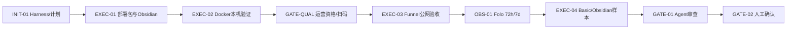
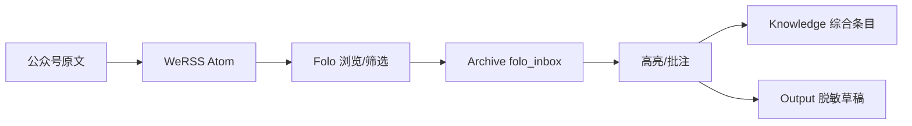

# Visual Map / 可视化图谱

Visual Map Contract: v1.0

## 图表索引

| ID | Type | Purpose | Required For Understanding | Source Evidence | Promotion Candidate |
| --- | --- | --- | --- | --- | --- |
| MAP-01 | phase | 区分 agent 实施、人工门禁和时间观察 | yes | `task_plan.md` | no |
| MAP-02 | data-flow | 展示数据与知识晋升 | yes | Architecture SSoT | yes |

## 阶段关系图

## 阶段表

| Phase ID | Kind | Depends On | State | Completion | Output | Required Evidence | Exit Command | Actor | Evidence Status | Blocking Risk | Owner / Handoff |
| --- | --- | --- | --- | ---: | --- | --- | --- | --- | --- | --- | --- |
| INIT-01 | init | none | done | 100 | Harness 与任务合同 | task files、status/check | `harness task-start 2026-07-14-werss-folo-obsidian-7118a818` | agent | present | none | coordinator |
| EXEC-01 | execution | INIT-01 | done | 100 | Compose/Caddy/脚本/文档/Inbox/Base | diff、静态检查、reviewer | `harness task-phase 2026-07-14-werss-folo-obsidian-7118a818 EXEC-01 --state done --completion 100 --evidence present` | agent | present | none | coordinator |
| EXEC-02 | execution | EXEC-01 | in_progress | 55 | Docker/Folo 安装和本机 smoke | App 签名、Docker running、RG-002 | `harness task-phase 2026-07-14-werss-folo-obsidian-7118a818 EXEC-02 --state done --completion 100 --evidence present` | agent | partial | Docker 协议与权限 | user + coordinator |
| GATE-QUAL | gate | EXEC-02 | planned | 0 | 公众号运营资格与 3 个试验源 | Chrome 扫码、WeRSS UI、RG-006 | manual qualification confirmation | human | missing | 无运营权限则停止 Funnel | user |
| EXEC-03 | execution | GATE-QUAL | planned | 0 | Funnel 与公网安全 | RG-003 | `harness task-phase 2026-07-14-werss-folo-obsidian-7118a818 EXEC-03 --state done --completion 100 --evidence present` | agent | missing | 首次 Funnel 网页批准 | user + coordinator |
| OBS-01 | execution | EXEC-03 | planned | 0 | Folo 72 小时/7 天判断 | observations、Folo UI、RG-007 | `harness task-phase 2026-07-14-werss-folo-obsidian-7118a818 OBS-01 --state done --completion 100 --evidence present` | coordinator | missing | 时间门禁 | user |
| EXEC-04 | execution | OBS-01 | planned | 0 | Basic/Obsidian 五类样本 | RG-008、恢复演练 | `harness task-phase 2026-07-14-werss-folo-obsidian-7118a818 EXEC-04 --state done --completion 100 --evidence present` | coordinator | missing | 登录/付费/样本 | user + coordinator |
| GATE-01 | gate | EXEC-04 | planned | 0 | Agent Review Submission | `review.md`、walkthrough、lesson | `harness task-review 2026-07-14-werss-folo-obsidian-7118a818 --message "全链路证据与审查就绪"` | agent | partial | live evidence 未齐 | coordinator |
| GATE-02 | gate | GATE-01 | planned | 0 | Human Review Confirmation | review packet 和人工确认 | Dashboard human confirmation | human | missing | Agent 不得代办 | user |

## 数据流

