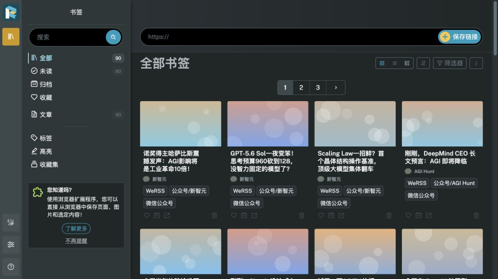
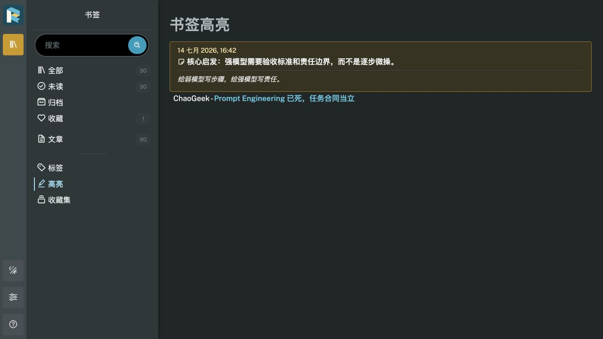

# Readeck 与 Obsidian 公众号阅读图文教程

## 一、这套系统解决什么

你的公众号内容被分成三层：

| 层 | 工具 | 放什么 | 你做什么 |
| --- | --- | --- | --- |
| 采集层 | WeRSS | 已订阅公众号和抓到的文章正文 | 添加公众号、检查定时任务 |
| 阅读层 | Readeck | 所有完整文章、阅读进度、收藏、高亮、批注 | 浏览、筛选、划线 |
| 知识层 | Obsidian | 人工选中的原文、高亮、批注和长期笔记 | 双链、评分、综合、提升 |

这样既不会把 90 多篇全文全部塞进 Obsidian，也不会把重要划线锁在某个付费云服务里。

## 二、日常阅读

打开：

```text
http://127.0.0.1:8002
```

外网 Tunnel 配好后也可以打开：

```text
https://reader.sumerchaser.top
```

登录用户名是 `summer`。密码只在本机 `.env` 的 `READECK_ADMIN_PASSWORD` 中，不要粘贴到聊天或截图。

左侧常用入口：

- “全部”：完整公众号文章库。
- “未读”：还没读完的文章。
- “收藏”：你明确准备长期保留的文章。
- “高亮”：所有摘录和批注汇总。
- “标签”：可按 `公众号/<公众号名>` 过滤。



每篇文章都会带三个自动标签：`微信公众号`、`WeRSS`、`公众号/<名称>`。标题下方显示公众号名称，便于筛选来源。

## 三、收藏、划线和批注

### 收藏整篇文章

打开文章后点心形收藏按钮。收藏表示：“这篇值得进入 Obsidian 继续处理”。

只标已读不会导入 Obsidian；收藏会导入。

### 划线

在文章正文中拖动选择文字，点击高亮颜色。同步到 Obsidian 后会变成：

```markdown
==给弱模型写步骤，给强模型写责任。==
```

### 给划线写批注

在高亮弹层中填写自己的判断。例如：

```text
核心启发：强模型需要验收标准和责任边界，而不是逐步微操。
```

只要存在高亮，即使整篇文章没有点收藏，也会进入 Obsidian。



左侧“高亮”会把所有公众号的摘录集中展示。你可以从这里回到原文，继续修改批注。

## 四、什么时候进入 Obsidian

后台 LaunchAgent 每 5 分钟运行一次：

```text
com.summer.wechat-rss-reading-sync
```

导入条件满足任意一个即可：

- 文章已收藏。
- 文章存在至少一条高亮或批注。
- 文章已经进入过 Obsidian，需要同步 Readeck 的后续变化。

目标目录：

```text
/Users/summer/Obsidian/SummerOS/
02_Archive/02_DailyProcessed/reading/readeck_inbox
```

需要立即同步时运行：

```bash
/usr/bin/python3 ~/.local/share/wechat-rss/reading-sync.py
```

## 五、Obsidian 笔记长什么样

文件名示例：

```text
2026-07-13-Prompt Engineering 已死，任务合同当立--DZrpDFJa.md
```

日期用于排序，短 ID 用于防止同标题覆盖。

一篇笔记从上到下分四部分：

1. 元数据：公众号、发布时间、阅读状态、评分、主题和提升去向。
2. 我的笔记：你自己的长期判断，机器永不覆盖。
3. 划线与批注：从 Readeck 自动同步的摘录。
4. 原文：公众号完整正文，高亮位置同时带批注脚注。

> Obsidian 实机截图将在 Mac 解锁后补入；当前真实笔记文件、同步 hash 和内容结构已经验证。

推荐在顶部补齐：

```markdown
> [!note] 我的笔记
> - 为什么保存：它解决了什么问题？
> - 核心判断：用一句话说出你的结论。
> - 我是否同意：同意、部分同意还是反对？
> - 可执行动作：读完以后要做什么？
> - 关联主题：[[主题A]]、[[主题B]]
```

人工字段：

```yaml
reading_status: 待读 # 待读 | 已批注 | 已提升
rating: 4           # 1-5
topics:
  - Agentic Coding
promote_to: Knowledge # 无 | Knowledge | Output
reviewed_at: 2026-07-15
```

`公众号精选.base` 会集中显示这些字段，可以按发布时间、状态、评分和主题排序。

当前图片默认引用 Readeck 资源，不会把所有公众号图片复制进 Vault。这样能控制附件体积；评级 4–5 或准备进入 Knowledge/Output 时，再单独本地化关键图片。

## 六、哪些内容不会被覆盖

同步器只允许刷新两个标记之间的机器区：

```html
<!-- readeck-sync:managed:start -->
<!-- readeck-sync:managed:end -->
```

以下内容会被保留：

- “我的笔记”整个区块。
- `reading_status`、`rating`、`topics`、`promote_to`、`reviewed_at`。
- 文件名和同名冲突保护。

真实样本已经验证：写入五条“我的笔记”后重新同步，日志显示 `Obsidian 更新 0 篇`，文件 SHA-256 和修改时间均不变。

## 七、从 Archive 提升到 Knowledge

公众号全文永远留在 Archive。不要把整篇原文移动到 `03_Knowledge`。

值得提升时：

1. 新建一篇自己的综合知识条目。
2. 引用 Archive 原文路径。
3. 合并多篇文章和自己的经验，而不是复述单篇原文。
4. 把原文的 `reading_status` 改为 `已提升`。
5. 把 `promote_to` 改为 `Knowledge` 或 `Output`。

这样 Archive 保留证据，Knowledge 保存你的模型，Output 保存可公开的脱敏表达。

## 八、文章不全或更新慢怎么查

按顺序判断：

1. WeRSS 中有没有这个公众号。
2. WeRSS 任务“公众号每小时自动更新”是否启用。
3. WeRSS 数据库是否已经出现文章。
4. 文章是否抓到完整正文；正文未就绪不会进入 Readeck。
5. 同步日志有没有报错。

查看服务和同步状态：

```bash
docker compose ps
tail -n 30 /tmp/wechat-rss-reading-sync.log
tail -n 30 /tmp/wechat-rss-reading-sync.err
```

微信没有 webhook，因此不是秒级实时。当前计划每小时第 17 分钟抓一次，抓到后 5 分钟内进入 Readeck。

## 九、手机和外网阅读

Cloudflare Tunnel 配置后，用手机浏览器访问 `https://reader.sumerchaser.top`，登录同一个 Readeck 账号即可。

外网访问仍有两层边界：

- Cloudflare 只连接 Readeck 专用本机反代 `127.0.0.1:8082`。
- Readeck 未登录首页只跳转登录页，未登录 API 返回 `401`。

WeRSS 管理后台 `127.0.0.1:8001` 不会暴露到公网。

## 十、备份

每周运行：

```bash
./scripts/backup.sh
```

备份包含 Readeck 的全文、收藏、高亮、批注以及同步状态。升级前先备份，再执行独立恢复演练：

```bash
./scripts/restore-test.sh
```

不要只备份 Obsidian；否则 Readeck 的未导入文章、阅读状态和高亮源数据会丢失。
