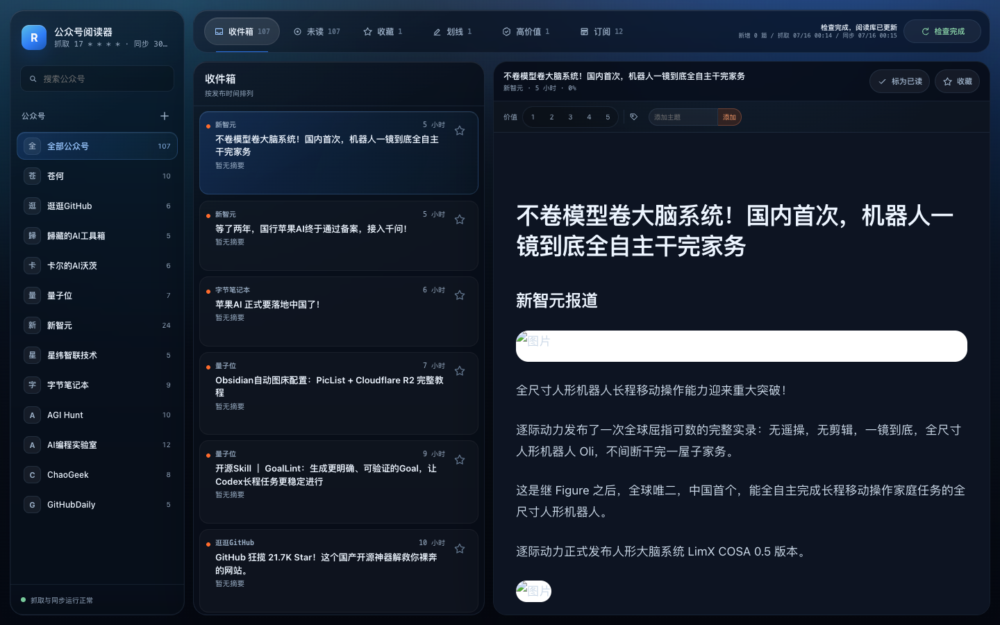
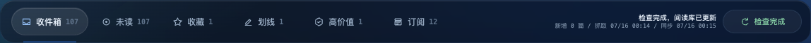
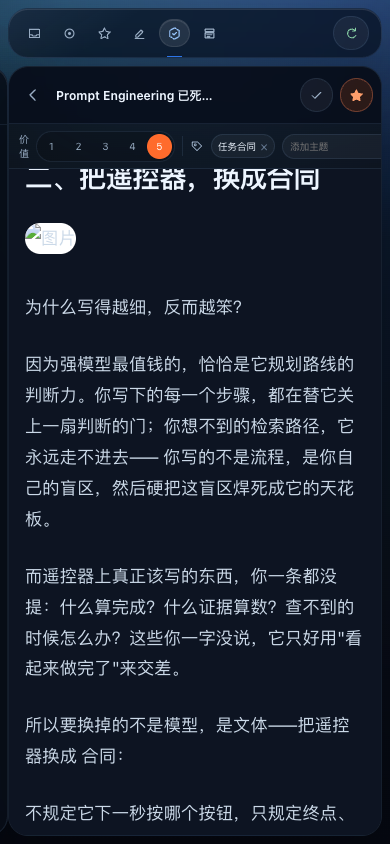
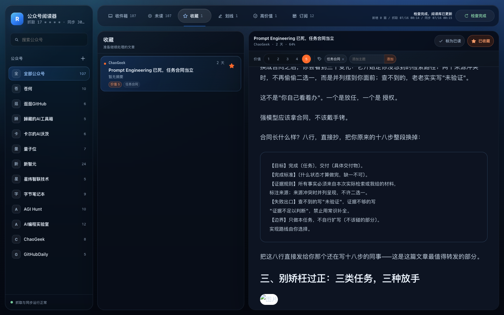
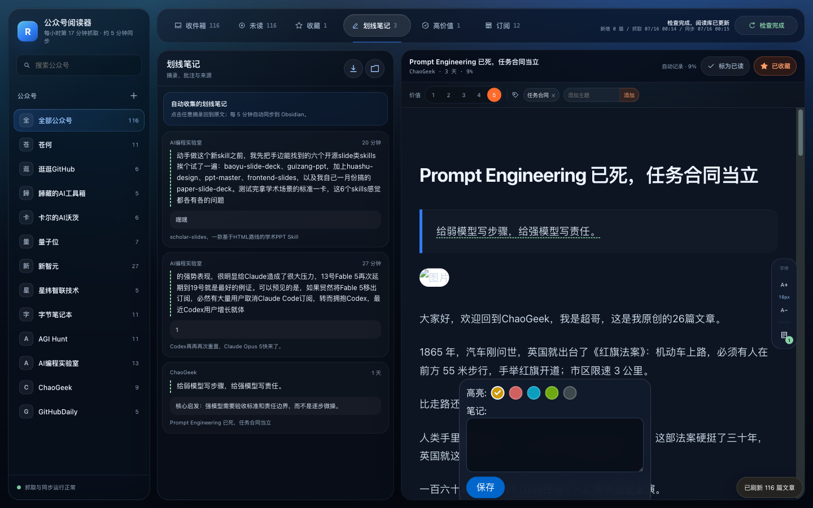
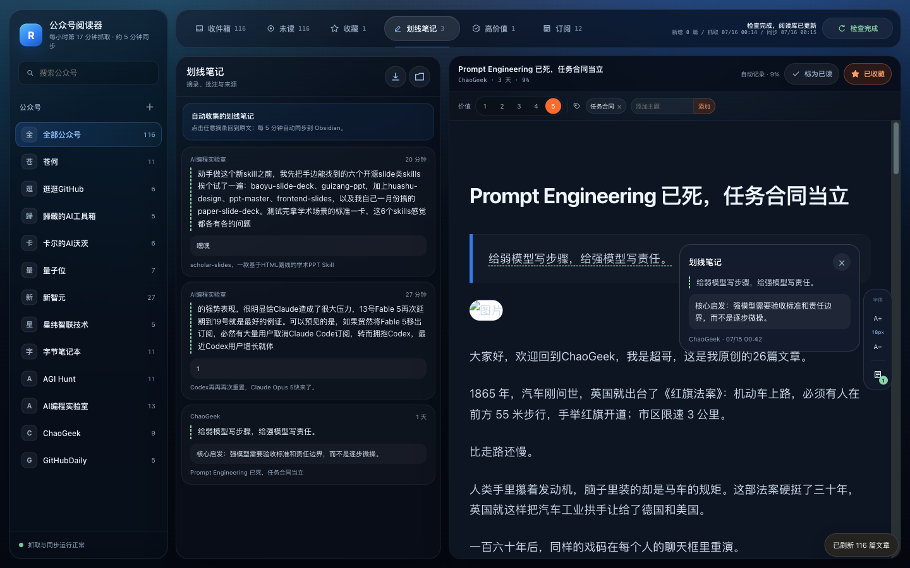
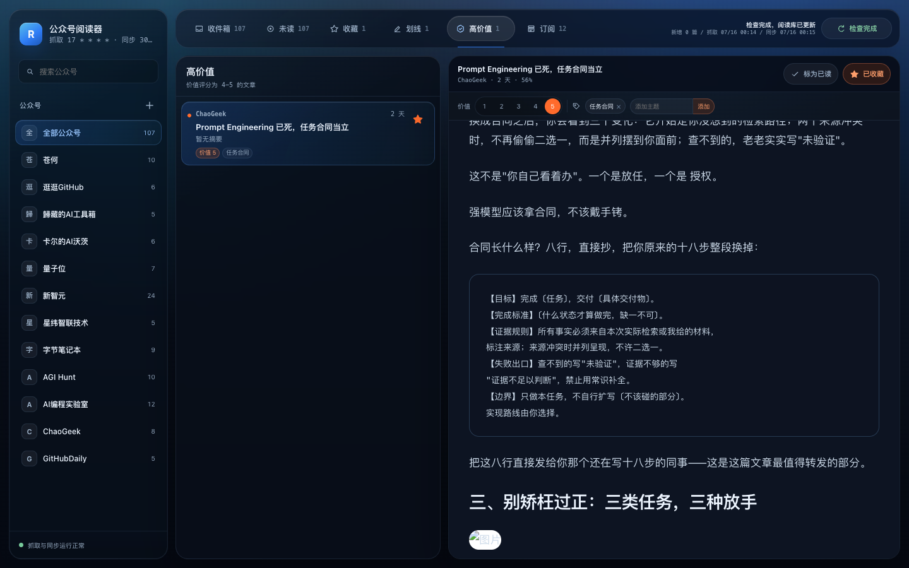
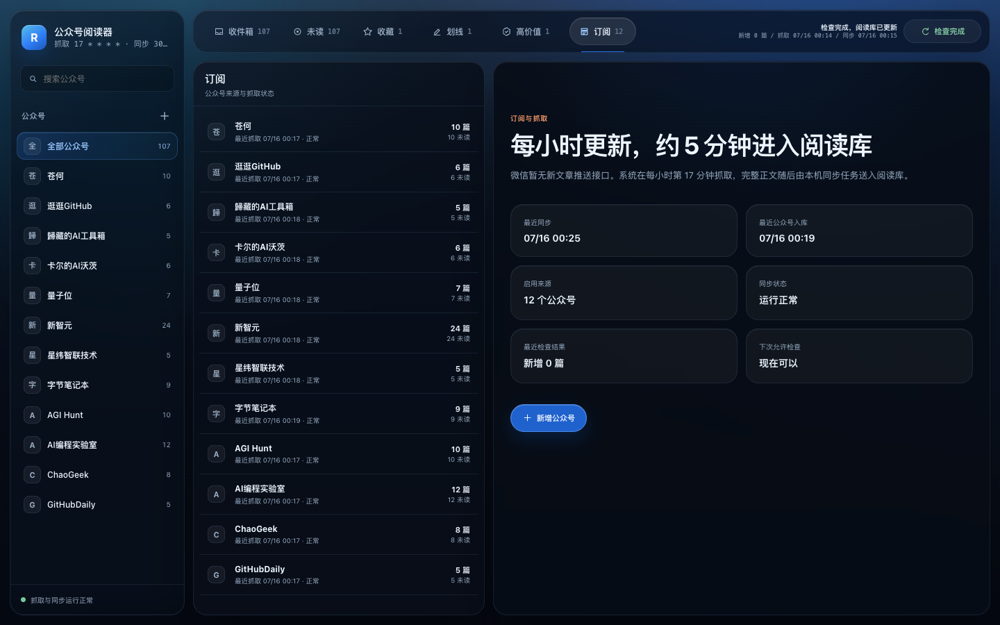
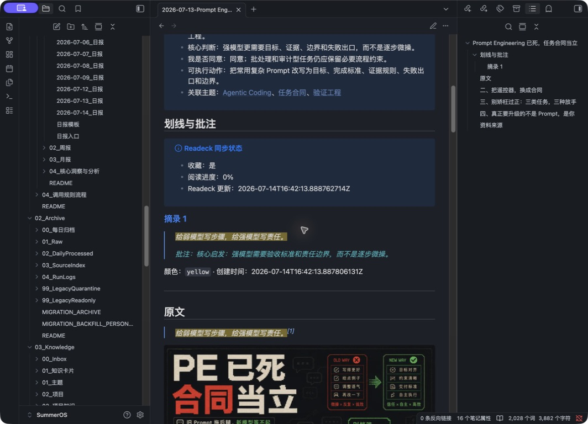
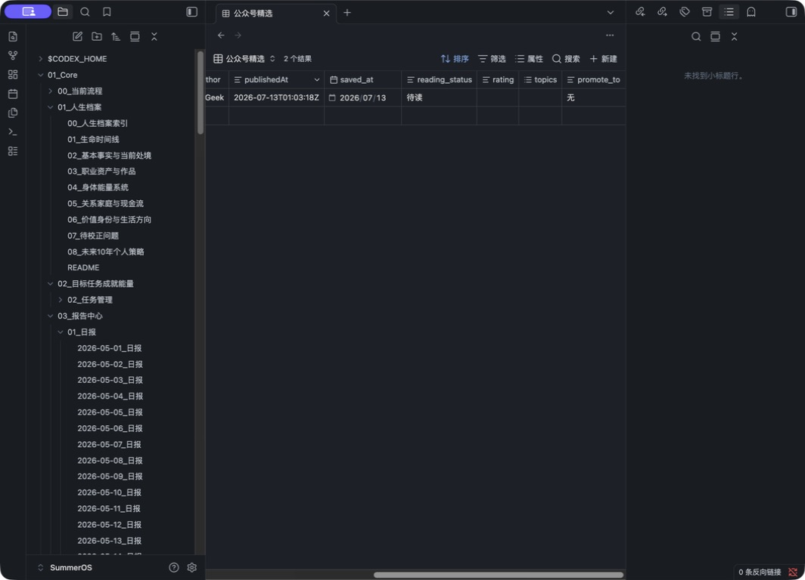

# Readeck 与 Obsidian 公众号阅读图文教程

## 一、这套系统解决什么

你的公众号内容被分成三层：

| 层 | 工具 | 放什么 | 你做什么 |
| --- | --- | --- | --- |
| 采集层 | WeRSS | 已订阅公众号和抓到的文章正文 | 添加公众号、检查定时任务 |
| 阅读层 | 中文 Reader + Readeck | Reader 负责三栏浏览，Readeck 持久保存全文、阅读进度、收藏、高亮、批注和标签 | 浏览、筛选、划线、评分 |
| 知识层 | Obsidian | 人工选中的原文、高亮、批注和长期笔记 | 双链、评分、综合、提升 |

这样既不会把 100 多篇全文全部塞进 Obsidian，也不会把重要划线锁在某个付费云服务里。当前实测为 12 个公众号、124 篇 WeRSS 文章、118 篇去重后的 Readeck 完整文章。

## 二、日常阅读

本机维护入口是：

```text
http://127.0.0.1:8002
```

日常阅读入口已经启用：

```text
https://reader.example.com
```

日常阅读不输入 Readeck 用户名或密码。新设备首次打开时只完成一次邮件验证码授权，之后一周内直接进入文章库；没有 Access 会话的请求读不到私人文章。本机 Readeck 管理账号只用于故障恢复，密码只在 `.env` 中，不要粘贴到聊天或截图。

桌面界面固定为三栏：左侧公众号与筛选，中间文章时间线，右侧正文。顶部六个 Tab 不会整页刷新：

- “收件箱”：全部完整文章。
- “未读”：`read_progress < 100` 的文章。
- “收藏”：准备进入 Obsidian 的文章。
- “划线笔记”：按条集中显示全部高亮、批注和来源。
- “高价值”：Reader 价值为 4–5 的文章。
- “订阅”：来源数量、最近抓取、未读数和健康状态。

数字键 `1–6` 可以切换六个 Tab，`S` 可以收藏或取消收藏当前文章。





正文采用 macOS 中文系统字体栈，桌面内容宽度控制在 680–760 px、行高约 1.8。正文右侧 `A+ / A-` 可以实时调整字号并记住选择。移动端自动变成单栏逐级进入，字号控件收纳到底部，顶部仍保留收藏、价值和主题入口：



每篇文章都会带三个自动标签：`微信公众号`、`WeRSS`、`公众号/<名称>`。标题下方显示公众号名称，便于筛选来源。

## 三、收藏、划线和批注

### 收藏整篇文章

时间线每一行和正文右上角都有始终可见的星标。点击后会立即变成橙色，顶部收藏数量同步变化；刷新页面后状态仍保存在 Readeck。

只标已读不会导入 Obsidian；收藏会导入。



### 已读状态

- 未读：`read_progress = 0`，列表显示橙色圆点。
- 阅读中：`read_progress = 1–99`，列表显示百分比。
- 已读：`read_progress = 100`。

打开文章约 1.5 秒后会自动进入“阅读中”，列表显示阅读百分比；滚动达到正文 80% 后自动标为已读，也可以点击正文顶部“标为已读 / 标为未读”手工反转。右侧字号控件会同步显示“自动记录 · 未读 / 阅读中 / 已读”。

### 划线

在文章正文中拖动选择文字，紧凑的 Apple 磨砂工具条会自动出现在选区右侧、左侧、上方或下方的空位，不遮住正在阅读的文字。选中文字的原有字体颜色不会改变；临时选区和保存后的持久高亮都显示为透明底淡绿色虚线。刷新页面仍然存在，同步到 Obsidian 后会变成：

```markdown
==给弱模型写步骤，给强模型写责任。==
```

### 给划线写批注

在高亮弹层中填写自己的判断。例如：

```text
核心启发：强模型需要验收标准和责任边界，而不是逐步微操。
```

只要存在高亮，即使整篇文章没有点收藏，也会进入 Obsidian。



保存后 Reader 会自动滚动到对应划线，在划线旁显示一张包含摘录、笔记和来源的小磨砂卡。顶部“划线笔记”会把所有公众号的摘录逐条集中展示；点任意一条即可回到原文对应位置并重新显示笔记卡。



### 导出划线笔记

“划线笔记”顶部有两个动作：

- 下载：生成 `公众号划线笔记-YYYY-MM-DD.md`，每条包含文章标题、公众号、日期、摘录、笔记和原文链接。
- Obsidian 目录：首次选择一个本机目录后，可把同一份汇总 Markdown 直接写入该目录；点文件夹按钮可随时重新选择或清除。

目录授权保存在当前浏览器设备，不会上传路径或 Readeck API Token。若手机浏览器或当前浏览器不支持目录授权，仍可使用 Markdown 下载。

### 价值评分和主题

正文顶部可以设置 1–5 价值评分和多个主题。系统使用 Readeck 标签持久保存：

```text
价值/5
主题/任务合同
```

每篇文章最多保留一个价值标签；“高价值”只显示价值 4–5 的文章。主题可以添加多个，并会跟随文章同步到 Obsidian 的受控字段 `reader_value`、`reader_tags`。



### 订阅与抓取状态

“订阅”Tab 会显示每个公众号的文章数、未读数、最近抓取和健康状态，并明确提示每小时第 17 分钟抓取、抓取后 5 分钟同步。右上角“检查新文章”可手工触发一次全部公众号抓取，完成后继续同步阅读库；控制端有 10 分钟冷却、single-flight、连续失败暂停和 `200013` 保护。



新增公众号时点左侧公众号标题旁的 `+`，打开你配置的 `https://werss.example.com/`。该入口使用独立 Cloudflare Access 应用和 AUD；授权后仍保留 WeRSS 原生管理登录。部署 Mac 也可用 `http://127.0.0.1:8001` 作为备用入口。

## 四、什么时候进入 Obsidian

后台 LaunchAgent 每 5 分钟运行一次：

```text
com.summer.wechat-rss-reading-sync
```

导入条件满足任意一个即可：

- 文章已收藏。
- 文章存在至少一条高亮或批注。
- 文章已经进入过 Obsidian，需要同步 Readeck 的后续变化。

目标目录：

```text
OBSIDIAN_INBOX_DIR=/绝对路径/你的Vault/reading/readeck_inbox
```

需要立即同步时运行：

```bash
/usr/bin/python3 ~/.local/share/wechat-rss/reading-sync.py
```

这是逐篇文章的后台自动同步路径，和“划线笔记”页的手工汇总 Markdown 互相独立。若要更改手工汇总位置，在“划线笔记”点文件夹按钮即可；若要更改后台自动同步路径，则需要修改同步器配置并重新安装 LaunchAgent。

## 五、Obsidian 笔记长什么样

文件名示例：

```text
2026-07-13-Prompt Engineering 已死，任务合同当立--DZrpDFJa.md
```

日期用于排序，短 ID 用于防止同标题覆盖。

一篇笔记从上到下分四部分：

1. 元数据：公众号、发布时间、阅读状态、评分、主题和提升去向。
2. 我的笔记：你自己的长期判断，机器永不覆盖。
3. 划线与批注：从 Readeck 自动同步的摘录。
4. 原文：公众号完整正文，高亮位置同时带批注脚注。



图中同一屏可以看到人工“我的笔记”的末尾、Readeck 同步状态、下划线摘录、批注和原文中的对应高亮。真实样本连续同步两次后 SHA-256 与 mtime 均保持不变。

推荐在顶部补齐：

```markdown
> [!note] 我的笔记
> - 为什么保存：它解决了什么问题？
> - 核心判断：用一句话说出你的结论。
> - 我是否同意：同意、部分同意还是反对？
> - 可执行动作：读完以后要做什么？
> - 关联主题：[[主题A]]、[[主题B]]
```

人工字段：

```yaml
reading_status: 待读 # 待读 | 已批注 | 已提升
rating: 4           # 1-5
topics:
  - Agentic Coding
promote_to: Knowledge # 无 | Knowledge | Output
reviewed_at: 2026-07-15
```

Reader 自动字段与人工字段互相独立：

```yaml
reader_value: 5
reader_tags:
  - 任务合同
```

同步器可以刷新 `reader_value/reader_tags`，但不会覆盖人工 `rating/topics`。

`公众号精选.base` 会集中显示这些字段，可以按发布时间、状态、评分和主题排序。



当前图片默认引用 Readeck 资源，不会把所有公众号图片复制进 Vault。这样能控制附件体积；评级 4–5 或准备进入 Knowledge/Output 时，再单独本地化关键图片。

## 六、哪些内容不会被覆盖

同步器只允许刷新两个标记之间的机器区：

```html
<!-- readeck-sync:managed:start -->
<!-- readeck-sync:managed:end -->
```

以下内容会被保留：

- “我的笔记”整个区块。
- `reading_status`、`rating`、`topics`、`promote_to`、`reviewed_at`。
- 文件名和同名冲突保护。

真实样本已经验证：写入五条“我的笔记”后重新同步，日志显示 `Obsidian 更新 0 篇`，文件 SHA-256 和修改时间均不变。

## 七、从 Archive 提升到 Knowledge

公众号全文永远留在 Archive。不要把整篇原文移动到 `03_Knowledge`。

值得提升时：

1. 新建一篇自己的综合知识条目。
2. 引用 Archive 原文路径。
3. 合并多篇文章和自己的经验，而不是复述单篇原文。
4. 把原文的 `reading_status` 改为 `已提升`。
5. 把 `promote_to` 改为 `Knowledge` 或 `Output`。

这样 Archive 保留证据，Knowledge 保存你的模型，Output 保存可公开的脱敏表达。

## 八、文章不全或更新慢怎么查

按顺序判断：

1. WeRSS 中有没有这个公众号。
2. WeRSS 任务“公众号每小时自动更新”是否启用。
3. WeRSS 数据库是否已经出现文章。
4. 文章是否抓到完整正文；正文未就绪不会进入 Readeck。
5. 同步日志有没有报错。

查看服务和同步状态：

```bash
docker compose ps
tail -n 30 /tmp/wechat-rss-reading-sync.log
tail -n 30 /tmp/wechat-rss-reading-sync.err
```

微信没有 webhook，因此不是秒级实时。当前计划每小时第 17 分钟抓一次，抓到后 5 分钟内进入 Readeck。

## 九、手机和外网阅读

用手机浏览器访问你配置的 `https://reader.example.com`。新设备输入一次邮件验证码，授权会话有效期内不会再看到 Readeck 登录表单。

外网访问有三层边界：

- Cloudflare Access 默认拒绝未授权会话，并由 `cloudflared` 校验身份令牌。
- Cloudflare Tunnel 只连接 Readeck 专用本机反代 `127.0.0.1:8082`。
- Reader Caddy 只把允许的身份映射到固定本机 Readeck 用户，不接受 URL Token 或前端硬编码凭据。

WeRSS 管理后台 `127.0.0.1:8001` 不会暴露到公网。

## 十、备份

每周运行：

```bash
./scripts/backup.sh
```

备份包含 Readeck 的全文、收藏、高亮、批注以及同步状态。升级前先备份，再执行独立恢复演练：

```bash
./scripts/restore-test.sh
```

不要只备份 Obsidian；否则 Readeck 的未导入文章、阅读状态和高亮源数据会丢失。
