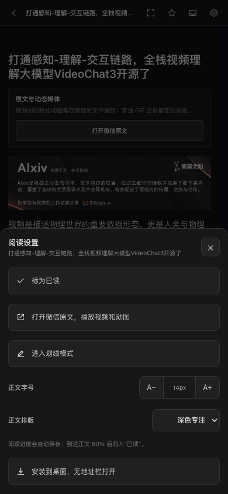
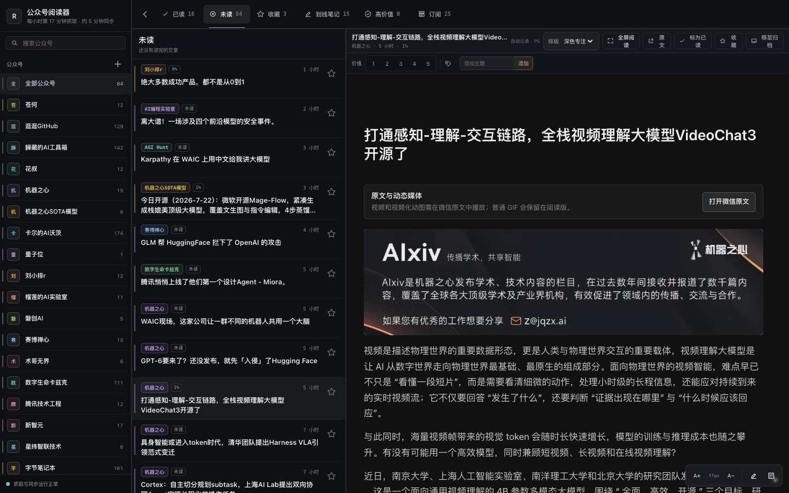
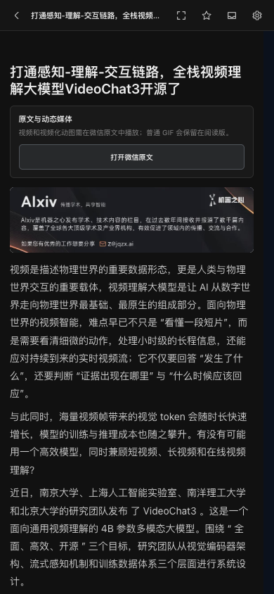

<!--
备选标题：
A. 我把公众号阅读器重做了一遍
B. 手机划不动、视频看不了？这次全修了
C. 自托管公众号阅读器：多端阅读更新

摘要：公众号阅读器新版重做了桌面与手机体验，补齐 GIF、图片和微信原文视频入口，并把全屏、排版、划线笔记与加载速度一起改顺了。

封面：../media/reader-v2/reader-v2-cover.png（1175 × 500）
发布时间建议：工作日 20:30—21:30
评论区话题：你最希望公众号阅读器下一步补上搜索、离线阅读，还是 AI 摘要？
-->

# 我把公众号阅读器重做了一遍

这套公众号阅读器上线后，我很快发现了一件尴尬的事：**抓取链路虽然通了，阅读本身却不好用。**

电脑端排版松散，右侧正文像一个临时预览框；手机端不仅字大、按钮挤，手指滑动还会和划线打架。更麻烦的是，公众号里的普通图片、GIF 和视频混在一起，用户只会得到一个结论：怎么又看不了？

所以这次没有继续补小洞。我把桌面端、手机端、正文排版、划线笔记和媒体处理重新做了一遍。

先看结果。

## 桌面端：三栏工作台和全屏阅读终于能共存

桌面版仍然保留公众号、文章时间线、正文三栏结构，但整体改成了更克制的深色工作台。信息密度更高，边框、阴影和按钮都收了很多，不再像一组临时拼起来的组件。

[▶ 播放桌面版 60 秒录屏](../media/reader-v2/reader-v2-desktop.mp4)

左侧公众号栏现在可以随时收起。打开文章后点“全屏阅读”，公众号列表、文章列表和顶部导航会一起隐藏，只留下正文与必要操作。

正文还增加了三套排版预设：

- **深色专注**：对比度高，适合夜间和长时间阅读。
- **石墨笔记**：更接近 Obsidian 的笔记质感。
- **浅色稿纸**：适合白天、长文和需要截图分享的场景。

选择会保存在当前浏览器里，下次打开仍然沿用。字号也会单独记住。

## 手机端：不是把电脑版缩小，而是重新排了一遍

之前手机端最要命的问题不是“丑”，而是**滑不动**。

正文放在独立阅读区域里，浏览器的触摸滚动、文章内部滚动和划线手势互相抢事件。结果就是手指明明在往上推，页面却卡在原地；想选一句话，又很容易整段甚至整篇变黄。

新版重新梳理了触摸层和滚动层：正常阅读时优先滚动，只有明确选中文字或进入划线模式后，才处理划线动作。手机默认字号降到 14px，行高、段距、标题和图片间距都一起缩小。

[▶ 播放手机版 53 秒录屏](../media/reader-v2/reader-v2-mobile.mp4)

顶部只保留返回、全屏、收藏、归档和设置。其他选项放进底部“阅读设置”，单手也能完成：

- 标为已读；
- 打开微信原文；
- 进入纯划线模式；
- 调整字号；
- 切换正文排版；
- 安装到桌面，像独立 App 一样打开。

## 图片和普通 GIF，现在会留在阅读版里

公众号文章里的 JPG、PNG 和普通 GIF，会由 Readeck 一起保存，再从阅读器自己的地址加载。这样做有两个好处：原图不再依赖微信 CDN 临时状态，跨设备打开时也不会因为第三方防盗链突然失效。

上面的 Mage-Flow 图片就是从已归档正文中直接加载的。截图只能看见某一帧，录屏里可以看到普通 GIF 继续播放。

这部分看起来只是“把图片显示出来”，实际解决的是离线归档、跨域、防盗链和移动端布局四个问题。

## 微信视频没有硬塞进来，而是给了可靠的原文入口

微信视频和“视频化动图”是另一回事。

它们常常依赖微信页面脚本、临时签名地址、登录状态和播放器运行环境。把一个当时能用的 MP4 地址硬抄进阅读器，今天也许能播，过几天签名失效就只剩黑屏。

所以新版采用了一个更诚实的方案：**安全阅读版负责稳定保存正文、图片和普通 GIF；遇到微信视频，则把“打开微信原文”放到文章第一屏。**

手机端也有同样的入口，不需要先滚到文章底部找来源链接。

为什么不直接运行公众号原来的整页 HTML？

因为原页面不只有排版。它还带着脚本、播放器、统计、推荐组件和随时可能变化的页面结构。全部照搬，会重新引入追踪与登录依赖，也会破坏阅读器自己的滚动、划线和安全边界。

现在保留的是标题层级、段落、图片、普通 GIF、表格、引用和代码等静态内容，再用自己的排版渲染。视频和强交互组件回到原文播放。**这不是百分之百复刻微信页面，而是在“稳定阅读”和“原始交互”之间划了一条清楚的线。**

## 划线笔记也重做了：回车确认，可以不写笔记

旧版划线最影响体验的地方，是选完文字后容易整篇变黄，批注框还会盖住正文。

新版默认行为是：拖选一小段文字后，出现一个磨砂笔记框。笔记可以留空，直接按回车就是纯划线；需要换行时按 `Shift + Enter`。

如果只想一路摘录，可以打开“划线模式”。这时拖选文字就立即保存划线，不再弹笔记框。系统还会检查选区长度和位置，发现整篇误选时直接取消，不让一篇文章突然全部变黄。

这里也顺便回答一个常见问题：**划线和笔记不是只存在浏览器里。**

它们会写进 Readeck 的批注数据，与收藏、已读状态和阅读进度保存在同一套服务端数据库中。电脑和手机打开的是同一个阅读库，所以可以多端同步。Cloudflare Tunnel 和 Access 只负责安全访问，不保存笔记内容；真正的数据仍在自己部署的 Readeck 里。

后台每 5 分钟还会把已收藏或含划线的文章同步到 Obsidian。机器更新原文和批注，人工笔记区不会被覆盖。浏览器本地只保存字号、排版预设和侧栏开关这类界面偏好。

## 加载速度和归档操作，也做了几处看不见的调整

视觉改完以后，我又把慢的地方逐项量了一遍。

现在首批请求读取 100 条文章，但时间线只先渲染 60 条，滚到接近底部再继续补。这样既保留足够多的可浏览内容，也避免一次把所有卡片塞进页面。

正文打开时先显示骨架状态，文章加载完成后再替换；阅读进度不会每滚一下就发一次请求，而是按阈值更新。

“移至归档”则改成了即时返回：点击后先回文章列表，再在后台保存状态。如果保存失败，界面会恢复原文章并提示错误。用户不需要盯着按钮等网络往返。

这些优化没有一个适合做大标题，但它们决定了阅读器用起来像产品，还是像后台管理页。

## 抓取和外网访问，不再依赖 Codex 常驻

生产链路仍然是：

**WeRSS 抓取公众号 → Readeck 保存全文与批注 → 自定义 Reader 阅读 → Obsidian 沉淀知识。**

WeRSS 上游本身提供公众号抓取、RSS 生成、定时更新和授权过期提醒能力；这套部署把固定调度交给 Cloudflare 相关组件和本机服务，不需要 Codex 常驻驱动。Reader 默认显示每小时第 17 分钟抓取、约 5 分钟同步的节奏。

点击“检查新文章”时，如果系统识别到微信授权失效，会直接进入二维码授权流程。扫码完成后再继续刷新，不再只给一个看不懂的失败提示。

外网访问通过 Cloudflare Tunnel 接入，Reader 和 WeRSS 管理端再分别经过 Cloudflare Access。Cloudflare 官方文档将 Tunnel 定义为由 `cloudflared` 发起的出站连接，源站不需要暴露公网 IP；Access 则在请求进入自托管应用前检查身份策略。

相关资料：

- [WeRSS 官方仓库](https://github.com/rachelos/we-mp-rss)
- [Readeck 官方网站](https://readeck.org/)
- [Cloudflare Tunnel 官方文档](https://developers.cloudflare.com/tunnel/)

## 这次更新真正解决了什么

这次没有增加一个听起来很炫的新概念，而是把每天都会碰到的小问题逐个改顺：

- 电脑端能收起侧栏，也能真正全屏；
- 手机端可以顺畅滑动，排版更紧凑；
- 普通图片和 GIF 留在阅读版；
- 微信视频第一屏就能回原文播放；
- 三套正文排版可以随时切换；
- 划线可以不写笔记，回车直接确认；
- 纯划线模式不再反复弹窗；
- 误选整篇会被阻止；
- 归档后立即返回列表；
- 笔记保存在自己的 Readeck，电脑和手机同步，再进入 Obsidian。

我越来越觉得，个人阅读工具最重要的不是功能多，而是**不要在用户刚想认真读一篇文章时制造阻力。**

项目已经开源，代码、部署说明和本次桌面/手机录屏都在仓库里：

[GitHub：summerchaserwwz/wechat-rss-reader](https://github.com/summerchaserwwz/wechat-rss-reader)

你最希望下一步补上什么：全文搜索、真正的离线阅读，还是 AI 摘要与问答？欢迎在评论区告诉我。

> **大家好，我是小柴**，C9 计算机本硕，做过产品，现在是 AI 算法工程师，持续分享 AI 资讯、智能体、开源实测和个人工具。你的点赞、关注和分享，是我继续更新的动力。
