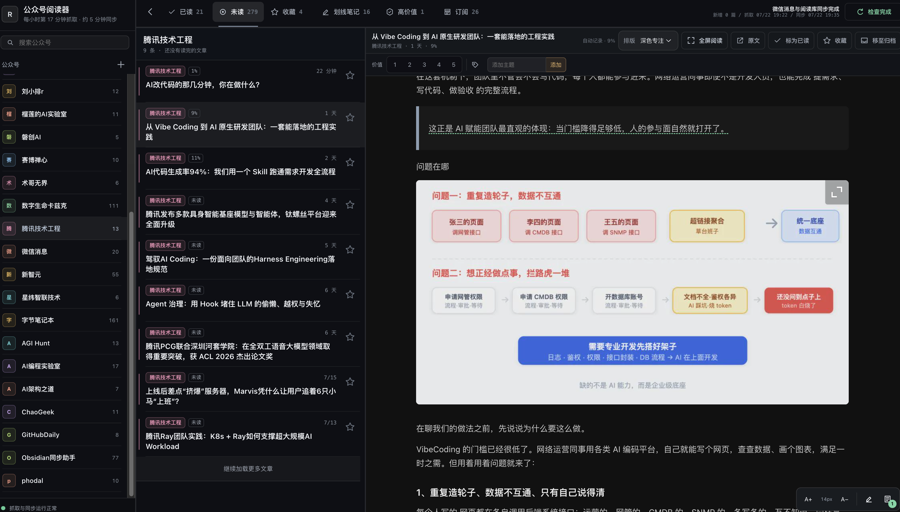

<!--
备选标题：
A. 大更新公众号阅读器，这次把手机、划线和视频都补齐了
B. 我把公众号阅读器又重做了一遍，这次终于像个产品了
C. 手机滑不动、视频看不了？新版阅读器这次全改了

摘要：公众号阅读器迎来一次大更新：桌面端支持收起侧栏和全屏阅读，手机端重做滑动与排版，同时补齐划线笔记、GIF、微信视频原文入口和自动更新。

封面：../media/reader-v2/reader-desktop-overview-v2.png
发布时间建议：工作日 20:30—21:30
评论区话题：你最希望下一版补上全文搜索、离线阅读，还是 AI 摘要？
-->

# 大更新公众号阅读器，这次把手机、划线和视频都补齐了

这几天，我又把自己的公众号阅读器重做了一遍。

它原来不是不能用。文章能抓，正文能看，划线也能存。但真把它当成每天都要打开的工具，问题一下就全冒出来了：电脑端太散，手机端滑不动，选句话很容易整篇变黄，公众号里的视频还经常只剩一个空位。

所以这次没加什么花哨概念，直接把最影响阅读的地方全部改了一遍。

先看新版。

## 电脑端终于像个正经阅读器了

桌面版还是公众号、文章、正文三栏，但整个界面重新压紧了。左侧公众号栏可以随时收起，打开长文后也能直接进入全屏，只留下正文和必要操作。

正文还加了深色专注、石墨笔记、浅色稿纸三套排版。字号和排版会自动记住，不用每次重新调。

## 手机端不是把电脑版硬塞进去

手机端这次基本是重新做了一遍。

公众号、文章时间线和正文拆成三个独立页面，底部导航负责切换。来源列表和文章列表都改成更紧凑的排版，正常阅读时手指优先控制滚动，不再和划线手势打架。

未读、收藏、划线笔记、高价值文章和订阅都能从底栏直接进入。文章行保留来源、进度和时间，但删掉了占地方的装饰。

## 划线笔记终于不折腾人了

现在拖选一小段文字，就会出现磨砂笔记框。可以直接输入笔记，也可以什么都不写，按回车保存纯划线。

如果只想一路摘录，还能打开“划线模式”：选中文字后立即保存，不再反复弹窗。系统也会拦住整篇误选，避免一松手全文变黄。

划线和笔记会写进自托管的 Readeck，电脑和手机打开同一个阅读库就能同步；收藏或带批注的文章还会继续进入 Obsidian。

## 图片和 GIF 直接看，微信视频一键回原文

普通图片和 GIF 会跟文章一起归档，直接留在阅读版里。微信视频和依赖微信播放器的动态内容没再硬塞进来，而是在文章第一屏放了“打开微信原文”。

这样普通内容继续干净阅读，碰到视频也不用翻到文章结尾找链接。

## 还有几处用起来才会发现的变化

- 首屏只加载当前需要的文章，列表打开更快；
- 滚到接近底部再继续加载，不一次塞进全部内容；
- 点击归档后立即回到列表，不用等网络请求；
- 阅读到 80% 自动归入已读；
- Cloudflare 定时触发抓取和同步，不需要 Codex 常驻；
- 微信授权过期后，手动刷新会直接进入二维码授权流程。

我自己连着用了几天，最明显的变化不是哪个按钮多了，而是手机终于能顺手刷完一篇文章。

电脑上想整理和保存时，左边三栏还在；真想专心读，就把它们收起来。视频不会装作能播，点一下回原文。该留下的划线和笔记，继续进自己的阅读库和 Obsidian。

项目已经开源，代码和部署说明都在这里：

[GitHub：summerchaserwwz/wechat-rss-reader](https://github.com/summerchaserwwz/wechat-rss-reader)

下一版你最想要哪个：全文搜索、真正的离线阅读，还是 AI 摘要和问答？

> **大家好，我是小柴**，C9 计算机本硕，做过产品，现在是 AI 算法工程师，持续分享 AI 资讯、智能体、开源实测和个人工具。
